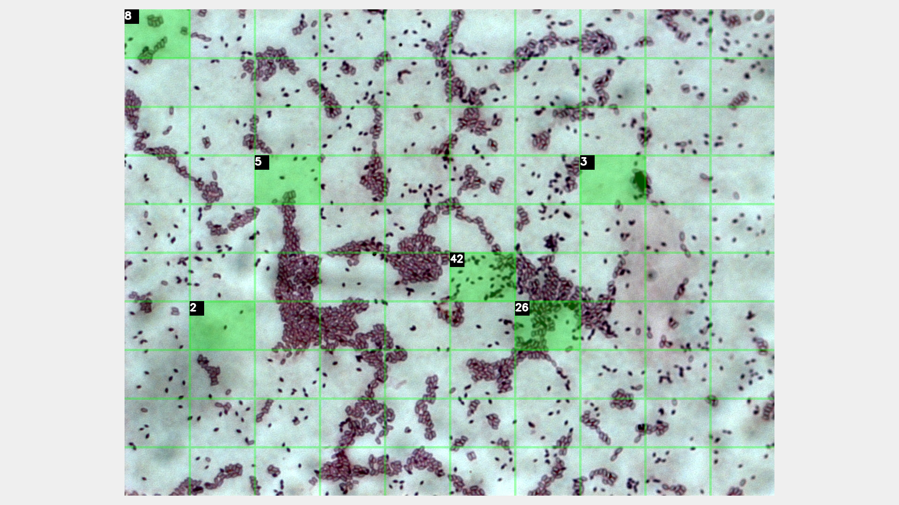
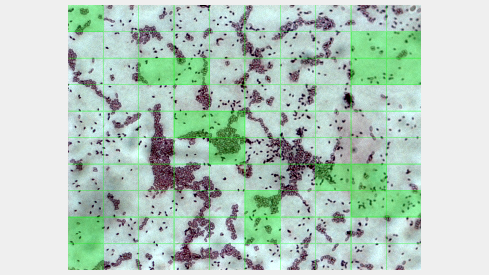
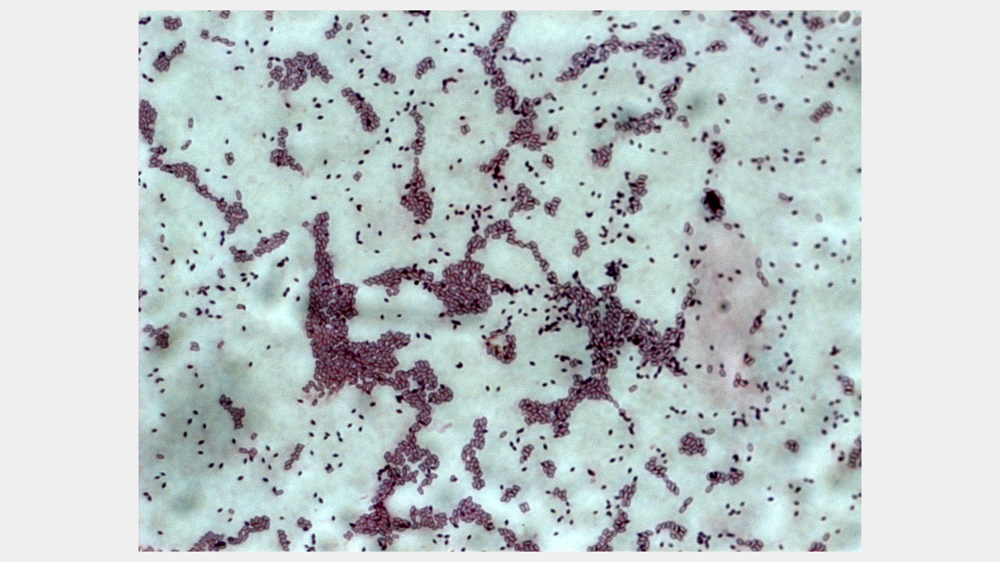
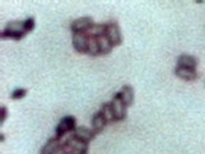
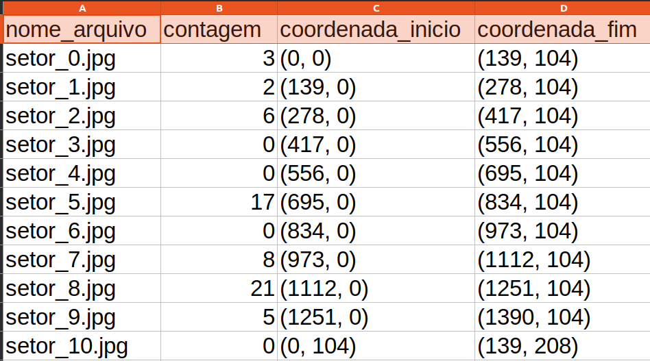

# MicroCount

Sistema auxiliar para a contagem de elementos capturados em placas via imagens microscópicas.

<p align="center">
    
</p>

## Sobre o Projeto

O projeto consiste de uma aplicação desenvolvida em Python e utilizando a biblioteca de processamento de imagens OpenCV visando auxiliar a contagem manual de elementos capturados em placas via imagens microscópicas. 

Uma técnica comumente utilizada na área de bioinformática é a divisão da imagem original em áreas menores, denominadas setores. Assim, a contagem individual de cada setor é realizada e, ao final, a contagem geral é obtida pela soma das parcelas de cada setor.

A ideia do projeto é automatizar parte desse processo, facilitando a divisão precisa da imagem em setores e fornecendo ferramentas para que o usuário possa marcar e contar os elementos manualmente dentro de cada setor. Isso permitirá uma contagem mais rápida e organizada, com a opção de ajustar e visualizar os setores de forma interativa. O objetivo final é melhorar a precisão e eficiência do processo de contagem, além de garantir que os resultados sejam facilmente registrados e exportados para futuras análises.

## Funcionamento

### Selecione uma imagem

```
*************** Escolha uma imagem ***************

1) SE11 - 1.jpg
2) BT 06 - quad 96 h- 5uL- corada.jpg
3) LCBM 6 - 2.jpg
4) T24_48h_foto2.jpg
5) 23.1 - 1.2.jpg


Escolha uma opcao:     2
```

### Imagem sob análise

Nessa página, há 3 visualizações diferentes possíveis para apresentar a imagem: visualização crua, visualização com setores e visualização com as contagens exibidas. As teclas ```f``` e ```r``` permitem a navegação entre elas.

Além disso, o evento de ```clique de mouse``` sobre um setor é capturado e é responsável por renderizar a página de ```Setor Selecionado```. Caso o clique seja sobre um setor já contabilizado, a ação realizada é de resetar a contagem definida no mesmo.

Para exportar os resultados registrados a tecla ```s``` é utilizada e para fechar a imagem e encerrar a aplicação basta apertar a tecla ```q```.

<p align="center">
    
    
    
</p>

### Setor Selecionado

Nessa página, o setor selecionado anteriormente é exibido e o evento de ```clique de mouse``` é utilizado para fazer pequenas marcações que auxiliam a contagem dos elementos. Para limpar as marcações a tecla ```r``` deve ser pressionada.

Ao final, com a contagem devidamente feita, basta apertar a tecla ```q``` para fechar o setor e avançar para a próxima etapa.

<p align="center">
    
    
</p>

### Informe a contagem

A contagem do setor selecionado é registrada e salva.

```
Setor 41 - Contagem: 17
```

### Exporte os resultados

Na página de ```Imagem sob análise```, a tecla ```s``` é utilizada para exportar os dados obtidos. Os setores não contabilizados são registrados com um valor predefinido no sistema, como o valor zero, por exemplo. Essa, e outras configurações da aplicação, são definidas no arquivo ```Settings.py```. Nesse caso, pela constante ```VALOR_CONTAGEM_PADRAO```.

Ao exportar a contagem, a imagem original e uma imagem de cada um dos setores é salva. Além disso, um arquivo csv com informações detalhadas de cada setor é criado. Todos esses arquivos são mantidos em uma pasta nomeada com a identificação da imagem original. A pasta utilizada para realizar a exportação também é definida no arquivo ```Settings.py```, por meio da constante ```CAMINHO_EXPORTAR_CONTAGEM```.

<p align="center">
    
</p>

### Settings

O arquivo ```Settings.py``` possui a definição de diversas constantes que modificam o funcionamento do sistema. Principalmente em relação à interface, é possível realizar um ajuste fino dos valores definidos para que a aplicação se adapte melhor aos diferentes cenários.

Sinta-se à vontade para personalizar o sistema ajustando os parâmetros necessários e otimizando a sua experiência conforme suas necessidades. 